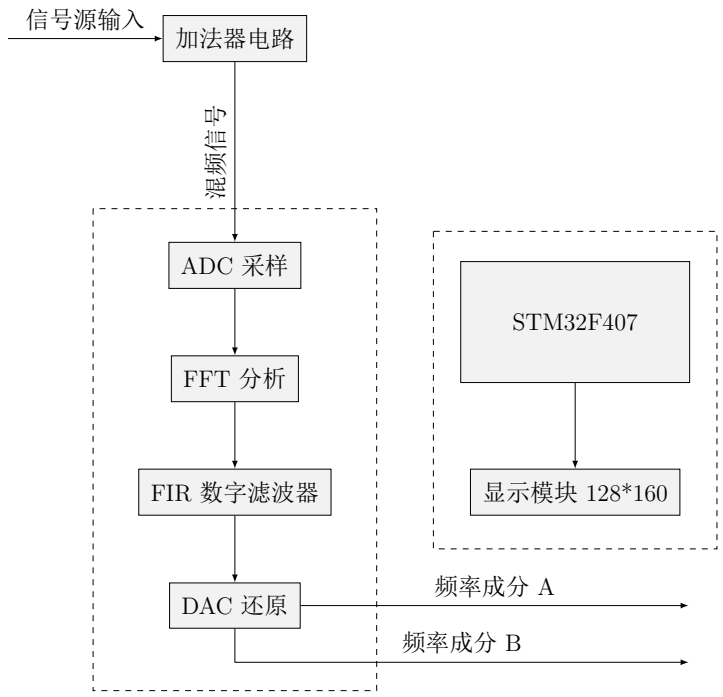
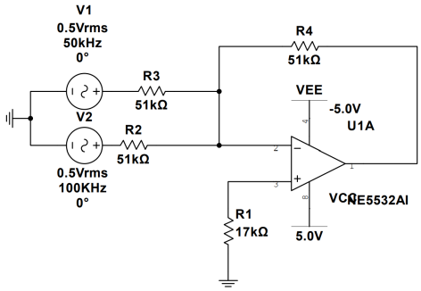
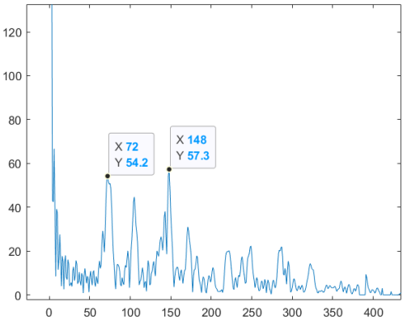
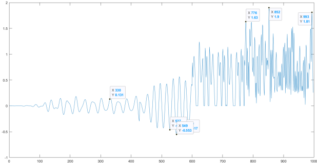
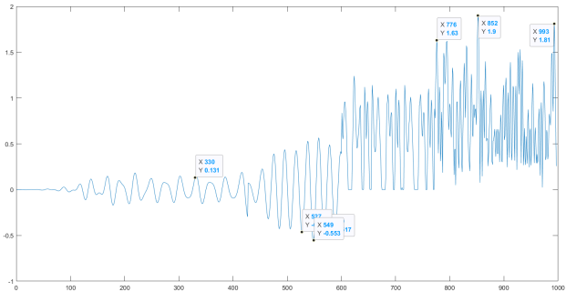

# TI Cup 2023 National Undergraduate Electronic Design Contest (NUEDC)

**Award:** Third Prize, Beijing Regional Division  
**Role:** Embedded Signal Processing & System Implementation

This project focuses on real-time signal acquisition, frequency spectrum analysis using FFT, signal separation via digital FIR filters, dual-channel DAC reconstruction, and TFT-LCD visualization — all implemented on an STM32F407 platform.

**项目中文名称**：基于STM32的混频信号分离与还原系统  
**比赛题目**：信号分离装置（H题）

## 项目概述

本系统以 **STM32F407** 为核心控制芯片，对输入的两路信号进行加法混合后，通过调用 **CMSIS-DSP** 库的 FFT 分析频谱成分，再利用预先设计的 **数字FIR滤波器** 进行频率分辨与分离处理，最后通过 **DAC** 还原出原始的两路模拟信号。同时集成 **TFT-LCD** 显示模块，可实时显示输入信号的频谱成分。

系统主要模块包括：
- 加法器电路（反相加法，使用运放实现）
- ADC 采样 + FFT 频谱分析
- FIR 数字滤波器组（Kaiser窗，MATLAB 生成系数）
- DAC 双通道输出
- 电源模块（干电池 + LM317/LM7905 稳压至 ±5V）
- TFT-LCD 显示（128×160）

关键词：**FFT** | **FIR 数字滤波器** | **ADC 采样** | **DAC 还原** | **CMSIS-DSP**

## 技术贡献 | Technical Contributions

- 利用 **CMSIS-DSP** 库的 `arm_rfft_fast_f32` 等函数实现实时频谱分析
- 通过峰值检测自动识别混频信号中的两个主要频率成分
- 设计多组带通FIR滤波器（MATLAB Filter Designer 生成），实现信号分离
- 双通道 **DAC** 还原分离后的模拟信号
- 实现从 ADC 采样 → FFT → 滤波 → DAC 的完整实时处理流水线
- TFT-LCD 显示波形与频谱（直观展示分离效果）
- 通过缓冲区与任务优化保证嵌入式平台的实时性

## 文件说明 | Files in this Repo

本仓库主要用于归档比赛成果材料，便于查阅与分享：

- **[NUEDC_Award.png](./NUEDC_Award.png)**  
  2023 年全国大学生电子设计竞赛（TI杯）北京赛区三等奖获奖证书

- **[B23212s.pdf](./B23212s.pdf)**  
  完整比赛设计报告（中文，7页），包含系统方案、理论分析、程序设计、测试结果等  

## 报告摘要（中文）

> 本系统以 STM32F407 为核心控制芯片，对输入的信号相加混合之后，调用 DSP 库中的 FFT 分析频谱成分，之后通过预先设计好的数字 FIR 滤波器，进行分辨和分离处理。最后通过 DAC 还原出两路信号。另外，本系统添加了 TFT-LCD 显示模块，可以直观显示出频谱成分。  
> 本系统主要有五个模块组成：加法器电路、采样滤波输出模块、电源电路模块、单片机控制电路及显示模块。其中电源模块达到使用移动电源供电要求，由两节干电池供电。  
> **关键词**：FFT; FIR 数字滤波器; ADC 采样; DAC 还原；DSP 库

## 系统总体架构
本系统由五个主要模块组成：加法器电路、采样滤波输出模块、电源电路模块、单片机控制电路及显示模块。系统首先对输入信号进行加法混合，然后通过 ADC 采样，利用 FFT 分析频谱，再经数字滤波器分离信号，最后通过 DAC 还原输出。整体设计注重稳定性和实时性。
系统总体框图如图3所示，展示了各模块的连接和数据流：

## 核心模块详解
### 加法器电路
加法器采用反相设计，以避免信号串扰并提高精度。电路基于运放构建，增益设置为1，通过电阻匹配确保输出为输入信号的线性叠加。实际测试中，电阻值优化为51kΩ以减少失真。电源部分使用干电池配合线性稳压器（LM317 和 LM7905）提供±5V稳定电压，抑制噪声。
反相加法器电路如图4所示：

### 数字信号处理流程
系统通过 ADC 采样（采样频率≥500kHz）获取数字信号，随后进行频域分析和滤波：
- FFT 频谱分析：使用 STM32 DSP 库的 arm_rfft_fast_f32函数进行快速傅里叶变换，提取信号频率成分。FFT 结果通过幅值计算识别主峰频率。
FFT 运算示例如图6：

- FIR 数字滤波器：基于 Kaiser 窗设计带通滤波器系数，通过 MATLAB 生成后导入单片机。滤波函数 arm_fir_f32实现实时卷积，分离目标频率信号。
滤波器兼顾分辨率与内存限制，窗函数示例如图5：

<!-- 滤波后信号通过 DAC 还原，波形稳定无漂移。滤波效果对比如图7： -->
<!-- 

 -->

## 程序设计要点
**频率域分析**：信号从时域转换至频域，通过峰值检测识别混合信号中的频率成分。

关键函数：

**FFT 初始化**：arm_rfft_fast_init

**滤波初始化**：arm_fir_init_f32

**实时处理**：循环执行采样、FFT、滤波和 DAC 输出。

## 测试结果摘要
系统通过函数信号发生器和示波器进行测试：

**加法器测试**：输入不同频率正弦波（如50kHz与100kHz），输出波形稳定，失真度低。

**滤波器测试**：能有效分离频率相近的信号，但受单片机内存限制，需优化窗函数阶数和采样点数。

（报告完整内容见 → **[B23212s.pdf](./B23212s.pdf)**）
